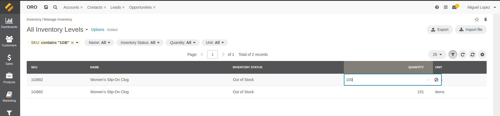
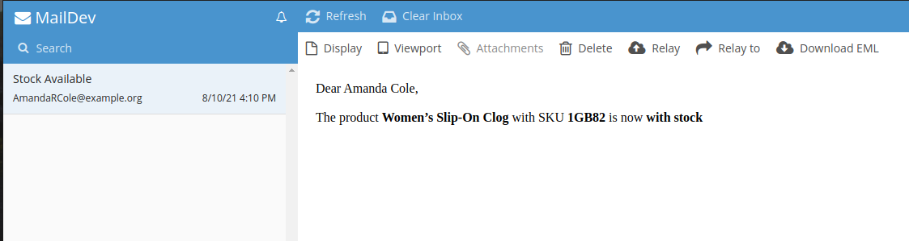

# Receive an email when the product is back in stock

## Inventory configuration
When you add stock to a product that has been out of stock, it will add the task of sending an email to the customer via the OroCommerce message queue.

## Receiving the email
An email will be sent to the customer if the client subscribed to a product that was out of stock after the quantity was increased.

