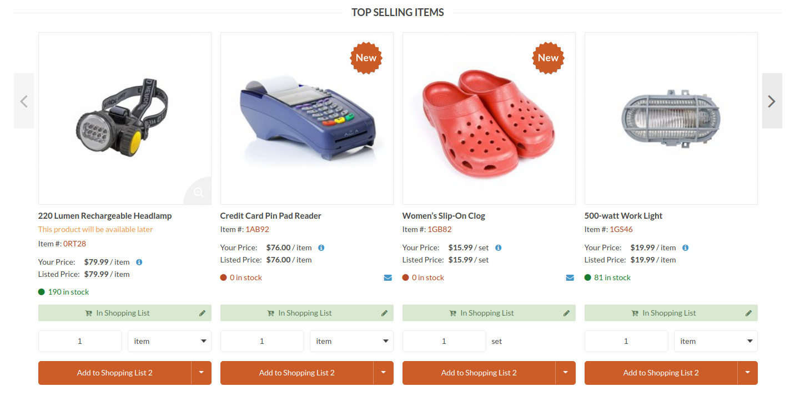

# Show the stock in the product view and subscribe when stock level is equal or below zero

## Action to subscribe a product

When a product’s inventory level is equal or below zero, you can subscribe or unsubscribe so that when the product’s inventory level get back to any positive value, you will receive an email with the information.

